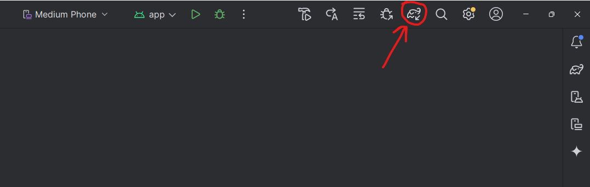
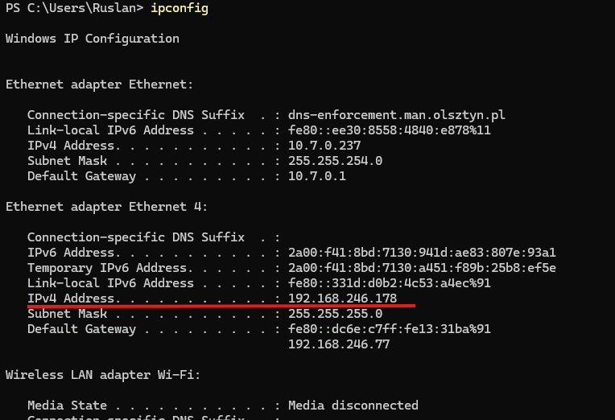

# TrafficEye
TrafficEye is a mobile application for static image traffic sign recognition, but with an attempt to implement real-time sign recognition. The system consists of an Android app (built with Kotlin) and a backend server (built with FastAPI in Python) which hosts a YOLOv8-based detection model.

[//]: # (![LOGO]&#40;documentation/uploads/trafficeye_logo.png&#41;)

<p align="left">
  
</p>

# Features

[//]: # (- Real-time traffic sign detection using device camera &#40;via TFLite model&#41;)
- Static image traffic sign detection via backend (FastAPI server)
- Bounding boxes and confidence levels displayed on camera preview

[//]: # (- Offline on-device detection and optional server detection)

# Technologies Used
<details>
<summary>🔍 Click for see more information about technologies</summary>

#### Mobile App:
- Kotlin
- Android Studio
- CameraX API
- TensorFlow Lite

#### Backend Server:
- Python 3.10+
- FastAPI
- Uvicorn
- OpenCV
- Ultralytics YOLOv8 (custom trained model)
</details>


# Installation
Clone repository or download it by .zip
```
# Select directory at the start, then clone repo
git clone https://github.com/Cavarano/Projekt-zespolowy-Visimind
```
### Android App

Open trafficeye2 folder in Android Studio.

The next step is to synchronize the project with Gradle so that all the necessary dependencies are installed

<p align="left">
  
</p>
Before enabling the application itself, you need to start the FastAPI server.

Build and run the app on a physical device (CameraX requires a real device).

### Backend Server (Local Development)

Open traffic_eye_serwer folder in any python code redactor.

1. Create and activate virtual environment:
```
python -m venv .venv
.venv\Scripts\activate # source .venv/bin/activate on Linux, MacOS
```
2. Install dependencies:
```
pip install -r requirements.txt
```
3. Run the server:
```
cd traffic_signs_detection
uvicorn main:app --reload --host 0.0.0.0 --port 8000 
```

> [!NOTE] Ensure the Android device and server are on the same local network. In the app, use the local IP of your machine in API requests. 
><details>
><summary>🔍 How to ensure</summary>
>If you use a USB cable and distribute the Internet through the cable, you should:
>
>1. Enter the command in Powershell or another terminal
>```
>ipconfig
>```
>2. Find there an Ethernet adapter Ethernet: or similar to this adapter and save its IPv4 Address
><p align="left">
>  
></p>
>
>3. And add this IP address to two files
>   1. app/res/xml/network_security_config.xml -> In the network-security-config block
>   2. app/kotlin+java/com.example.trafficeye2/MainActivity -> In the uploadImageToServer function
>   \
>   val request = Request.Builder()
>                   .url(“http://192.168.246.178:8000/detection/detect-signs/”)
>
>
>After all these steps, you will most likely be in the same local network as the Phone and the Device running the local server
></details>


