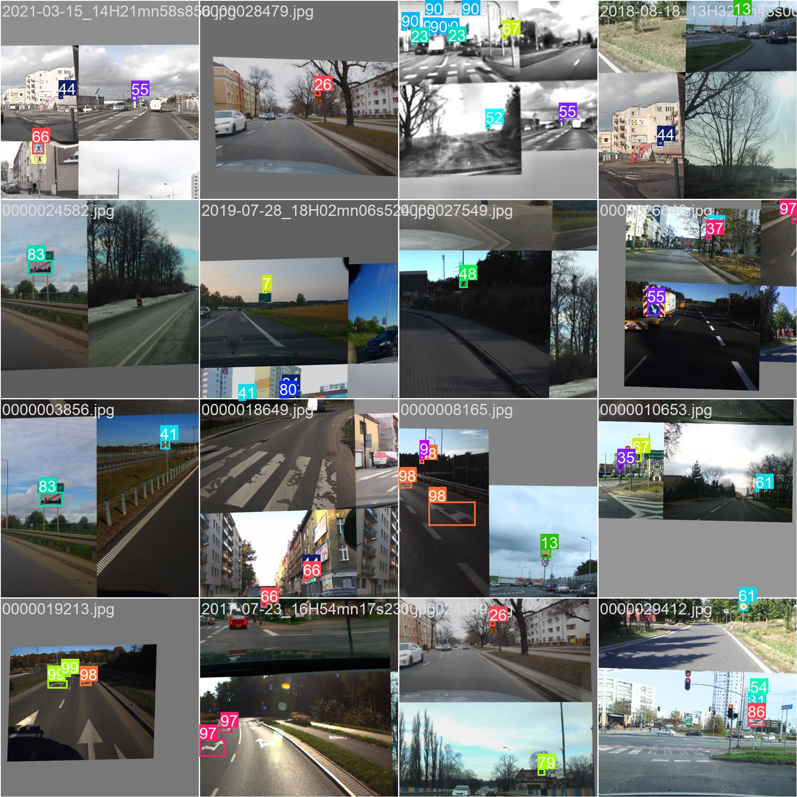

# TrafficEye
TrafficEye is a mobile application for static image traffic sign recognition, but with an attempt to implement real-time sign recognition. The system consists of an Android app (built with Kotlin) and a backend server (built with FastAPI in Python) which hosts a YOLOv8-based detection model.

[//]: # (![LOGO]&#40;documentation/uploads/trafficeye_logo.png&#41;)

<p align="left">
  
</p>

# Features

[//]: # (- Real-time traffic sign detection using device camera &#40;via TFLite model&#41;)
- Static image traffic sign detection via backend (FastAPI server)
- Bounding boxes and confidence levels displayed on camera preview

[//]: # (- Offline on-device detection and optional server detection)

# Technologies Used
<details>
<summary>🔍 Click for see more information about technologies</summary>

#### Mobile App:
- Kotlin
- Android Studio
- CameraX API
- TensorFlow Lite

#### Backend Server:
- Python 3.10+
- FastAPI
- Uvicorn
- OpenCV
- Ultralytics YOLOv8 (custom trained model)
</details>


# Installation
Clone repository or download it by .zip
```
# Select directory at the start, then clone repo
git clone https://github.com/Cavarano/Projekt-zespolowy-Visimind
```
### Android App

Open trafficeye2 folder in Android Studio.

The next step is to synchronize the project with Gradle so that all the necessary dependencies are installed

<p align="left">
  
</p>
Before enabling the application itself, you need to start the FastAPI server.

Build and run the app on a physical device (CameraX requires a real device).

### Backend Server (Local Development)

Open traffic_eye_serwer folder in any python code redactor.

1. Create and activate virtual environment:
```
python -m venv .venv
.venv\Scripts\activate # source .venv/bin/activate on Linux, MacOS
```
2. Install dependencies:
```
pip install -r requirements.txt
```
3. Run the server:
```
cd traffic_signs_detection
uvicorn main:app --reload --host 0.0.0.0 --port 8000 
```

> [!NOTE] Ensure the Android device and server are on the same local network. In the app, use the local IP of your machine in API requests. 
><details>
><summary>🔍 How to ensure</summary>
>If you use a USB cable and distribute the Internet through the cable, you should:
>
>1. Enter the command in Powershell or another terminal
>```
>ipconfig
>```
>2. Find there an Ethernet adapter Ethernet: or similar to this adapter and save its IPv4 Address
><p align="left">
>  
></p>
>
>3. And add this IP address to two files
>   1. app/res/xml/network_security_config.xml -> In the network-security-config block
>   2. app/kotlin+java/com.example.trafficeye2/MainActivity -> In the uploadImageToServer function
>   \
>   val request = Request.Builder()
>                   .url(“http://192.168.246.178:8000/detection/detect-signs/”)
>
>
>After all these steps, you will most likely be in the same local network as the Phone and the Device running the local server
></details>

# Research & ML
During the project, a lot of effort was spent on data pre-processing. 
We received the data in image format without labeling, so we had to determine 
which signs our model would recognize and which would not, and manually label 
all the photos. We used such technology as labelme. The company provided us 
with 5244 photos, but after labeling and discarding the photos with no road 
signs at all or hardly visible, we were left with 2600+- photos. Our team 
immediately realized that for such a large project, we still needed to expand 
the dataset, which we did. After two additional dataset expansions, 6729 photos
were provided for our model, of which 75% of the data was used for training,
15% for validation, and 10% for testing.  This was very important for 
the project, as it was the first time we worked with model training and 
wanted to do the best we could and at the same time understand how the 
training works.

<details>
<summary>🔍 Click for see more information about ML</summary>

## Expand dataset

<p align="left">
  
</p>

The Mappilary program was used to expand the dataset. I downloaded photos from it using a script and then labeled them.

## Achievements

|               Training Metrics                | Labels Histogram |
|:---------------------------------------------:|:----------------:|
|  |  |

### Training and Validation Metrics
This multi-plot figure shows the training and validation progress over epochs:
- Box loss / Class loss / DFL loss: All loss functions decrease — indicating learning progress.
- Precision / Recall / mAP@50 / mAP@50-95: All metrics increase — suggesting the model generalizes well to validation data.

### Dataset Label Distribution and Placement
This figure provides a detailed analysis of the annotated training dataset:

- Top-left: Histogram of instances per class. Useful for detecting class imbalance.
- Top-right: Bounding box anchor visualization — shows how anchor boxes are sized and placed.
- Bottom-left: Object center heatmap (x/y coordinates). This highlights where in the image objects usually appear.
- Bottom-right: Width/height distribution — shows that most objects are relatively small.


|                       Correlogram                        | Confusion Matrix |
|:--------------------------------------------------------:|:----------------:|
|  |  |

### Class Co-occurrence (Correlogram)
This correlogram represents how frequently different traffic sign classes appear together in the same image.
- Each square represents a pair of classes.
- Brighter colors mean higher co-occurrence.

### Confusion Matrix (Normalized)

This matrix illustrates how often predictions match the actual classes:

- Diagonal cells represent correct predictions.
- Off-diagonal cells show confusion between classes.

### Training Batches Visualization

|                    Correlogram                     |                    Confusion Matrix                    |
|:--------------------------------------------------:|:------------------------------------------------------:|
|  |  |

These visualizations represent two sample training batches used during model training. The images are shown with their corresponding bounding boxes and class labels.

These visuals are useful for verifying that:
- bounding boxes are correctly positioned,
- labels match the objects,
- and the dataset covers diverse conditions.

### Validation Predictions Visualization

|                      Correlogram                      |                   Confusion Matrix                    |
|:-----------------------------------------------------:|:-----------------------------------------------------:|
|  |  |


These images show the predictions made by the YOLOv8 model on a sample of the validation set.

Each predicted object is displayed with:
- a bounding box,
- a class label,
- and a confidence score.

## 📊 Model Comparison and Selection
During the development process, we trained and evaluated seven (more but no sens) different YOLOv8 models using various configurations, datasets, and training parameters. Below is a comparison of their performance metrics:

| Model                      | Dataset Extension         | Epochs | Precision ↑ | Recall ↑    | mAP50 ↑     | mAP50-95 ↑  | Box Loss ↓  | Cls Loss ↓  | DFL Loss ↓ |
|----------------------------|---------------------------| ------ |-------------|-------------|-------------| ----------- | ----------- | ----------- | ---------- |
| YOLOv8s.pt (FIRST MODEL)   | Visimind dataset 2600+-   | 50     | 0.86613     | 0.80068     | 0.86381     | 0.66727     | 0.69533     | 0.39464     | 0.84124    |
| YOLOv8n.pt                 | +2500 images              | 70     | 0.926       | 0.869       | 0.928       | 0.709       | 0.8557      | 0.54        | 0.897      |
| YOLOv8m.pt                 | +2500 images              | 50     | **0.948**   | 0.903       | 0.947       | 0.757       | 0.6974      | 0.3717      | 0.8561     |
| YOLOv8s.pt (default train) | +2500 images              | 70     | 0.93658     | **0.92352** | **0.95315** | **0.77851** | 0.62419     | 0.33248     | 0.83531    |
| YOLOv8s (aug+params)       | +2500 images (augmented)  | 70     | **0.94127** | 0.91069     | 0.95098     | 0.76688     | 0.75699     | 0.3895      | 0.86131    |
| YOLOv8m Last               | +2500 + 1046 images (aug) | 70     | 0.92624     | 0.91176     | 0.93892     | 0.76647     | **0.47121** | **0.27451** | **0.7281** |
| **YOLOv8s Final**          | +2500 + 1046 images (aug) | 70     | 0.9224      | 0.8985      | 0.93589     | 0.76237     | 0.72337     | 0.39293     | 0.85337    |

### Model Selection Justification

### What Do These Numbers Mean? 🤔
- **Precision**: How often the model is right when it says, “That’s an A-1 sign!” (Higher = fewer false positives.)
- **Recall**: How many signs the model spots out of all the signs in an image. (Higher = fewer missed signs.)
- **mAP50 & mAP50-95**: Mean Average Precision, a “overall score” for how well the model detects signs across different confidence thresholds.
- **Losses**: How much the model “messes up” during training. (Lower = better learning.)

After comparing all metrics, we selected YOLOv8s Final as the best trade-off between speed, accuracy, and model size, which is important for deploying on mobile devices.

### Why YOLOv8s Final? 🏆
After battling buggy bounding boxes and sipping way too much coffee, we crowned **YOLOv8s Final** as our champ. Here’s why it’s the MVP:
- **Solid Accuracy**: mAP50-95 of 0.76237 means it nails most signs, even in tough conditions.
- **Lightweight**: Its float16 format is compact, perfect for mobile devices and servers.
- **Versatile**: Trained on over 5000 augmented images, it handles rain, dusk, and weird angles like a pro.
- **Speed (almost there)**: Designed for real-time detection (~15 FPS planned), though we’re still tweaking mobile performance.

Sure, YOLOv8m models scored slightly higher in some metrics, but they’re like a gas-guzzling supercar—great for the track, not for daily drives. YOLOv8s Final is our “hybrid SUV”: efficient, reliable, and ready for the road! 😄

### How It Works (or Will Work!) 🚦
1. **Mobile App**: Upload a photo or use the camera, and the model draws boxes with labels (e.g., `A-1: 0.92`). *Note: Real-time detection is still in progress—stay tuned!*
2. **FastAPI Server**: Send an image, and the server returns detections in ~5 seconds. We’re working to speed this up for smoother analysis.
3. **Example**: Check out our detection on `test4.png`:
<p align="left">
   
</p>

</details>

# 📱 Mobile App Preview

The TrafficEye mobile application provides an intuitive and minimal interface that allows users to either activate the camera for real-time detection or upload a static image for analysis.

<details>
<summary>🔍 UI</summary>

### 🔵 Main Screen

<p align="left">
   
</p>

The home screen includes two main options:
- **Camera on** – launches the real-time detection mode using the built-in TFLite model.
- **Upload** – allows users to upload an image from their device for backend analysis via the FastAPI server.

A short slogan at the bottom reinforces the app's mission:  
`DriveSafe helps drivers detect and understand road signs instantly using AI-powered recognition.`

### 🟦 Detection Result & Explanation

<p align="left">
   
</p>

After analyzing an image, the application displays:
- Detected road signs with bounding boxes and confidence levels.
- A list of identified signs with Polish descriptions explaining their meaning and purpose.

This combination of visual detection and educational context helps users quickly understand and learn traffic signs, improving both awareness and safety.

</details>

# License

This project is licensed under the [MIT License](documentation/LICENSE).

# Traffic Eye Team

## GUI & App:

- [Maciej Kała](https://github.com/Cavarano)
- [Alina Upirowa](https://github.com/alinaupyrova)


## Backend

### Connecting the model to the camera in real time, Tester
- [Mateusz Kruszewsi](https://github.com/kru3zec)

### Database, FastAPI server
- [Eryk Żabiński](https://github.com/erykz415)

## ML, fixing errors, combining logic
- [Ruslan Zhukotynskyi](https://github.com/ruslanzhuk)